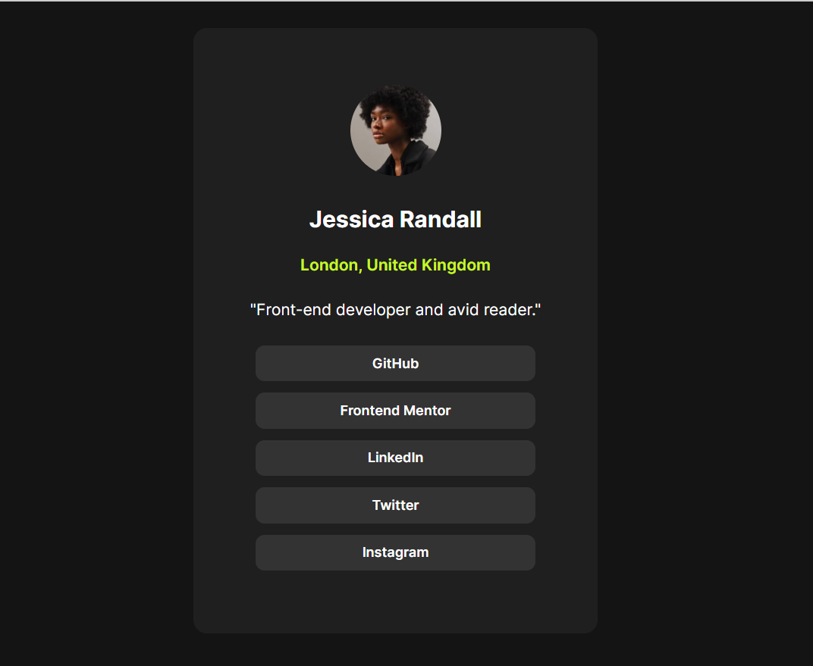

# Frontend Mentor - Social links profile

## Welcome! 👋

This is a solution to the [Social links profile challenge on Frontend Mentor](https://www.frontendmentor.io/challenges/social-links-profile-UG32l9m6dQ). 

## Overview

### The Challenge

This challenge is to build out this recipe page and get it looking as close to the design as possible. This task is to build out the project to the designs inside the `/design` folder and the required assets for this project are in the `/assets` folder. There is also a `style-guide.md` file containing the information, such as color palette and fonts.

### The Challenge

This challenge is to build out this recipe page and get it looking as close to the design as possible. This task is to build out the project to the designs inside the `/design` folder and the required assets for this project are in the `/assets` folder. There is also a `style-guide.md` file containing the information, such as color palette and fonts.

### Screenshot

## My process

### Built with

- Semantic HTML5 markup
- CSS custom properties
- Flexbox
- CSS Grid

### What I learned

I learned how to style the web using basic CSS. This challenge is very suitable for beginners who want to apply HTML and CSS to real project. 

### Useful resources

- [Resource 1](https://www.w3schools.com/css/) - This helped me for understanding and providing examples of how to apply CSS tools.
- [Resource 2](https://developer.mozilla.org/en-US/docs/Web) - This is an amazing web to selftaught html and css. 